# Relaatiotietokannan peruskäsitteiden harjoitukset:
# tehtävä1

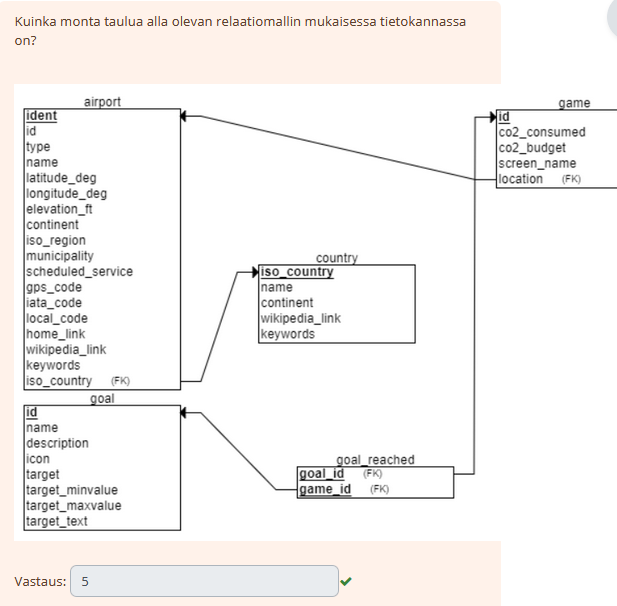
# tehtävä2
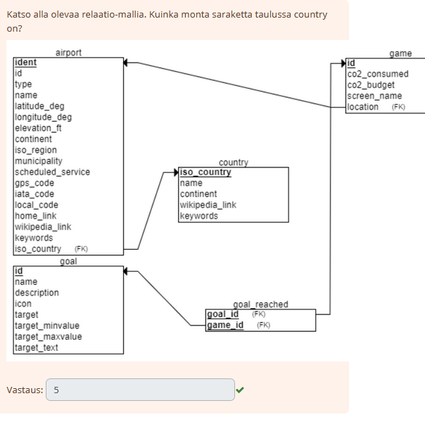
# tehtävä3
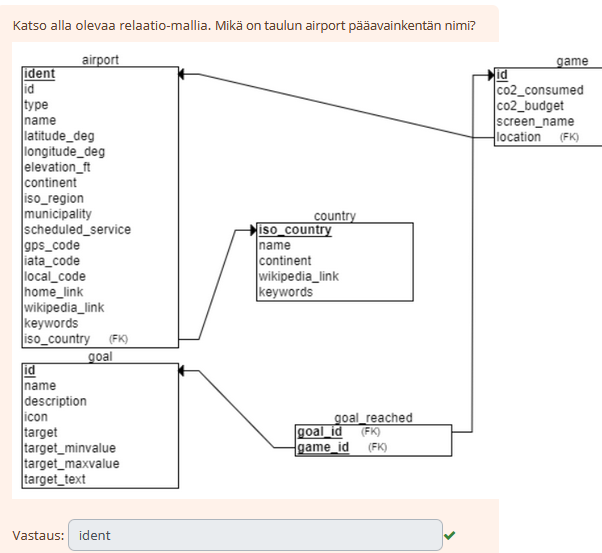
# tehtävä5
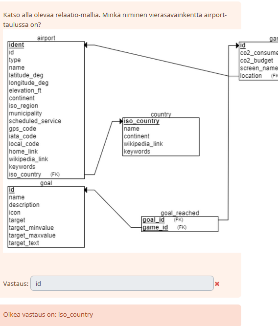
# tehtävä6
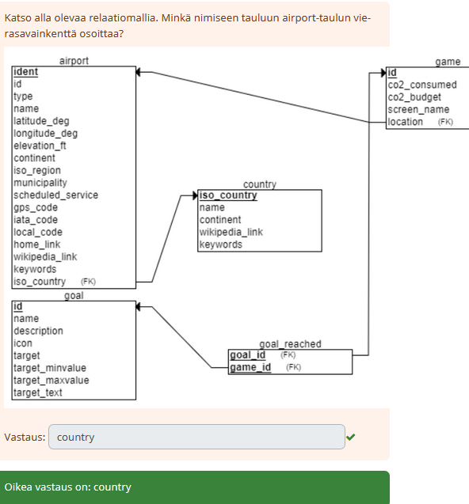
# tehtävä7
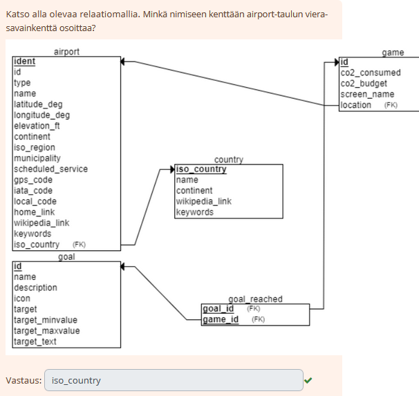
# tehtävä8
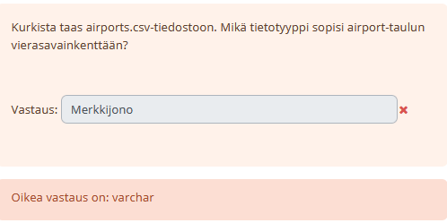
# tehtävä9
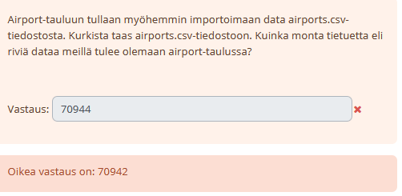
# tehtävä10
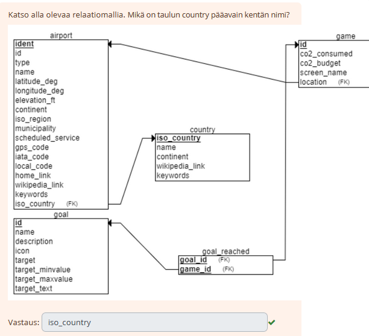
# tehtävä11
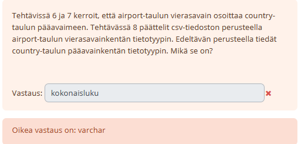
# tehtävä12
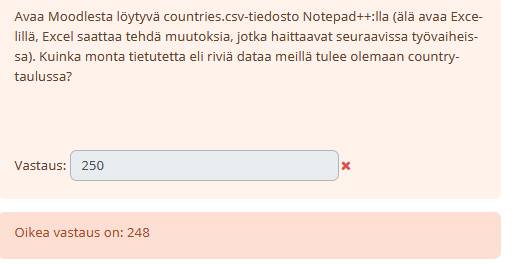
# tehtävä13
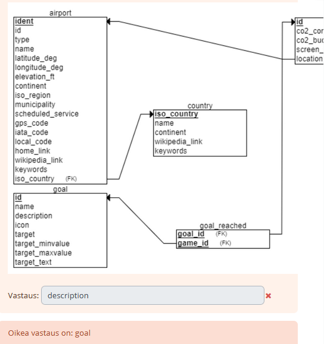
# tehtävä14
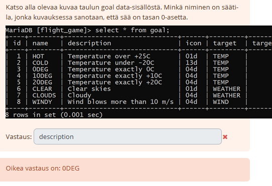
# tehtävä15
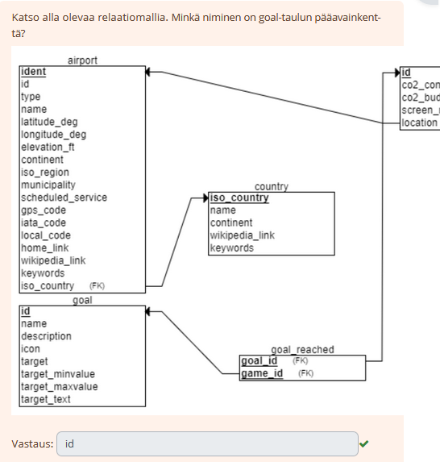
# tehtävä16
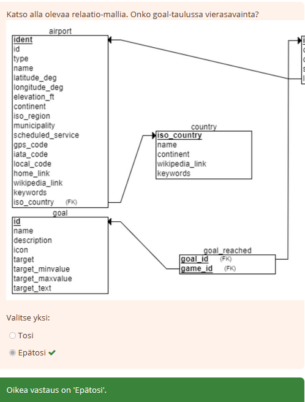
# tehtävä18
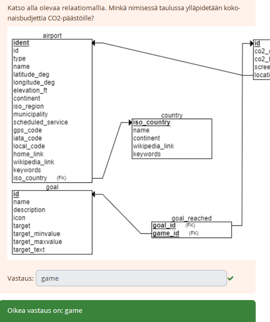
# tehtävä19
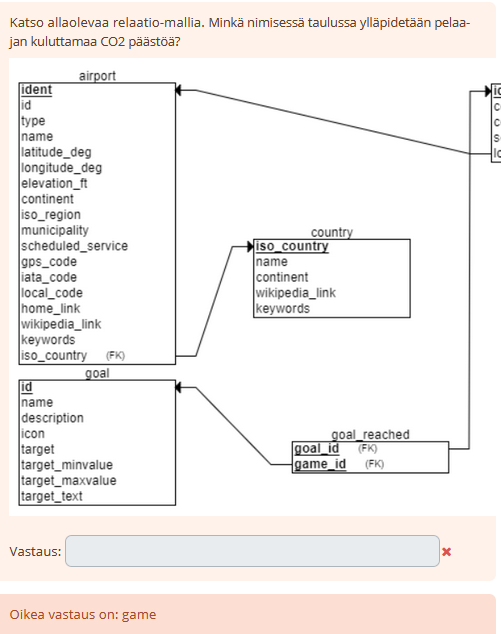
# tehtävä20
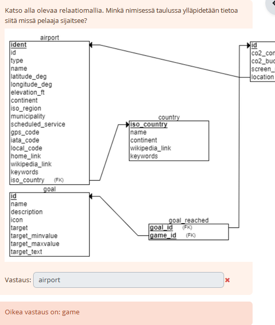

# tehtävä21
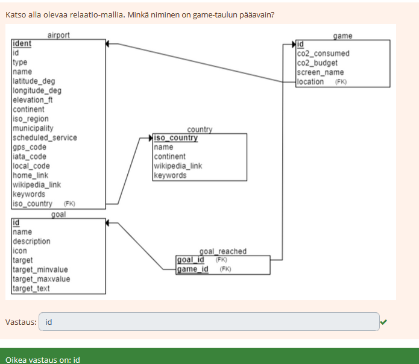

# tehtävä22
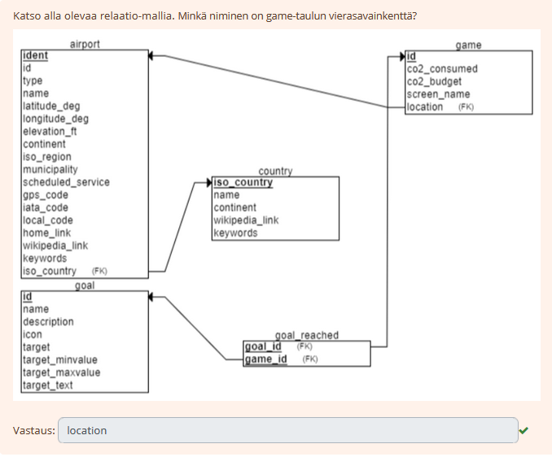

# tehtävä23
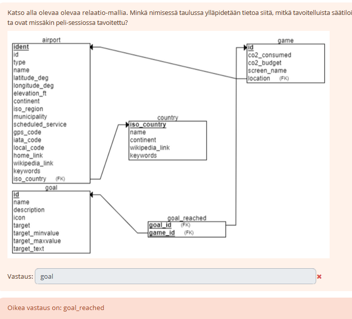

# tehtävä24
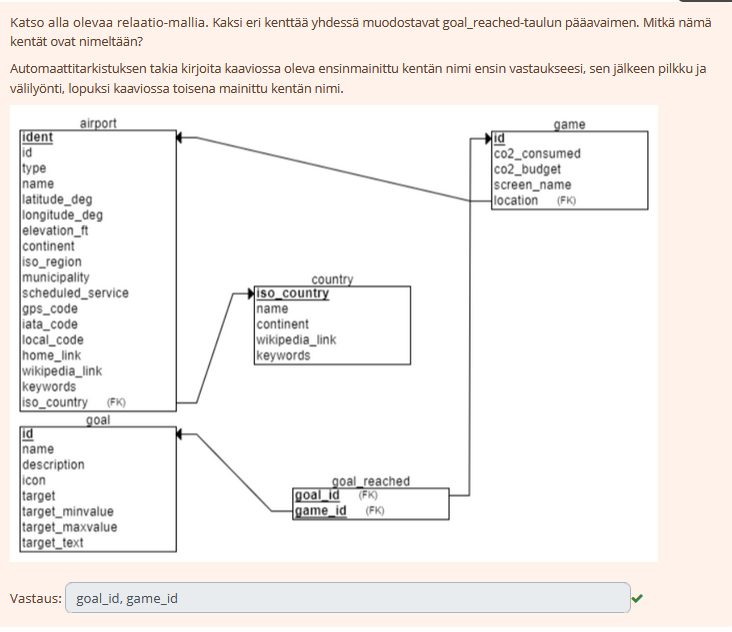

# tehtävä25
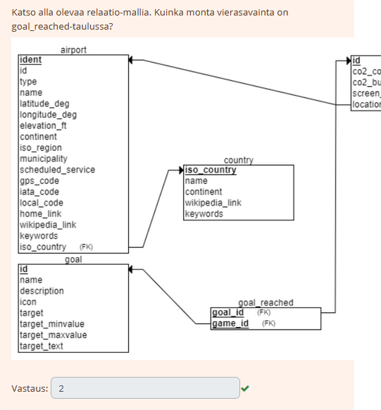

